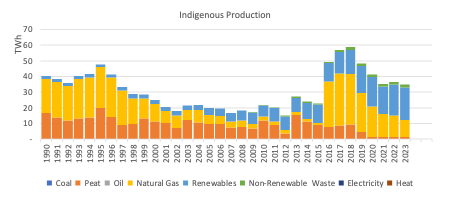

##  Ireland’s energy trends since 1990

The Sustainable Energy Authority of Ireland recently published the final energy balance for 2023, which is essentially a spreadsheet that summarises what energy sources are produced and consumed by different sectors, going back to 1990. Each year I update my own tracker with the SEAI’s new energy balance and I always find the trends fascinating. Here are some interesting insights from this year’s balance, with a broader view of energy trends over the past 24 years.

The SEAI’s own analysis is available on [this webpage](https://www.seai.ie/data-and-insights/seai-statistics/key-publications/national-energy-balance/), along with the energy balances themselves, and their deeper “Energy in Ireland” report is published annually, which contains a lot more information. The analysis below is just reporting the main trends that jump out at me.  

### Indigenous production
-	For the first time, Ireland produces more wind energy than natural gas. Overall renewables production overtook natural gas in 2021, and now the growth in RE (mainly wind, but also some solar PV and ambient heat – heat pumps) and fall in natural gas production (as the Corrib field declines) means that renewables production is nearly double that of natural gas.
-	The other remarkable thing about this graph is the near elimination of peat in Ireland’s energy production. Until the mid-2010s, peat was still the main form of energy produced in Ireland, despite the known environmental and climate damage it caused. Until 2018-2019, the majority of peat produced was “milled peat”, which was burned for electricity, but since the last peat-fired power stations were closed or switched to burning biomass, the remaining little “sod peat”, also known as turf, is burned in the residential sector.
-	When looking at this graph (and all graphs of energy production and consumption) it’s worth bearing in mind the “primary energy fallacy”: because of the inherent inefficiencies in fossil fuels (and other energy sources that you have to burn) over many clean energy fuels and technologies (like wind and solar, heat pumps, EVs), graphs which compare these sources in terms of their primary energy actually underplay the role of clean fuels in the energy system.
-	Ireland still imports more than four-times the energy than we produce. In the next section, we will look at our total primary energy demand.

### Primary energy requirement
-	The graph below describes the energy that Ireland consumes, rather than the energy it produces. The major difference is oil, which is still the main engine of our energy system. Some interesting observations from this graph include the relative stability of our primary energy demand, despite a growing population and economy. This is for a number of reasons:
-	Firstly, as we use more electricity, and more of that electricity comes from renewables, we can consume more energy services for the same amount of primary energy.
-	Secondly, energy consumption is falling in some sectors, like residential buildings and industry, because of efficiency standards, retrofits, and a move away from less efficient fuels – we will see these trends in graphs describing our energy consumption.
-	Finally, Ireland’s economic growth is driven (mainly) by non-energy-intensive industries, so there has been a decoupling of GDP and primary energy requirement.

### Electricity input and generation
-	Unfortunately, the SEAI energy balance doesn’t easily show the evolution of the electricity generation mix, which represents the amount of electricity generated from each fuel source, but it can be used to show the amount of each fuel that enters the electricity sector, below.
-	The great news is that peat, oil and coal are now close to being eliminated from power generation – a remarkable achievement. Despite this, the consumption of natural gas has been relatively stable over the past 20 years, as renewables (mainly wind energy) have replaced the most polluting and least efficient fuels. What is also remarkable is that even though the total fuel input to power generation is steady, the amount of electricity generated is growing strongly – it has doubled since 1997. More on why electricity demand is growing so strongly later…
-	Around 7% of our electricity was met by imports last year, which is a record figure.

### Total final energy consumption
-	The final graphs will look at the fuels that are consumed in the end-use sectors, like transport, industry and buildings. Electricity is growing both absolutely and as a share of consumption, up to 22% in 2023, from 14% in 1990. But still more than half of our energy consumption is taken up by oil, which in these graphs includes jet kerosene for aviation.

####	Industry
The graph of energy use in industry shows the swich from oil to natural gas. Have we reached peak natural gas use in industry? The decline is apparent since before the 2021 energy crisis. Most energy is used in cement production, the manufacture of alumina, and food processing.

####	Transport
Oil dominates, with demand nearly back to the level seen in 2019. Biodiesel accounts for 3% of transport energy demand, three quarters of which is imported. Consumption of jet kerosene overtook petrol (gasoline) back in 2017 and is now at an all-time high – demand is more than three-times what it was back in 1990. Demand for diesel has grown even faster since then, but I expect that we have passed peak-oil use in private cars.  

####	Residential
This sector has undergone a dramatic energy transition since 1990, when peat and coal accounted for 60% of the energy consumption in houses. Oil then quickly took over as the main fuel, and accounted for 45% of energy use in 2010, and its use has been fallowing slowly and steadily since then, with variations depending on the international oil price and the severity of winter cold. The last time oil use was this low was in 2014, during the last spike in the global oil price. Notable is the decline in energy use in homes, which have gotten more efficient even as they’ve gotten bigger and more numerous, and the increasing share of electricity, which now makes up 27% of home energy use. It’s good to see renewable energy start to show more prominently on this graph, albeit still very small. Notably, ambient heat (the renewable energy that heat pumps make use of) now produces more energy for homes than coal does, for the first time. Peat still produces slightly more. Heat from district heating has yet to feature in these statistics.

####	Services and data centres
Last, but not least, a topic that gets a lot of attention (including from me): What is causing such a boom in electricity demand? Data centres. Reported under “Informational and Communication” in the “Commercial Services” sector, energy consumption in data centres is skyrocketing.

The following graph compares the growth in electricity production from wind energy since 2009 – now our largest source of indigenous energy – with the trend in energy consumption from data centres. A cumulative 70% of this growth in wind energy since 2009 would be used up by data centres if it was allocated entirely to them. If we just compare the growth in electricity consumption from data centres and generation from wind energy since 2016, they are matched almost exactly.
